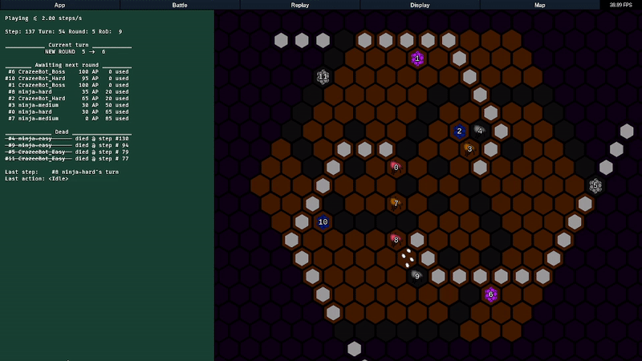

# Bot Royale
A battle royale for bots.

 

## Requirements
- [Python 3.9+](https://www.python.org/)
- [Kivy](https://pypi.org/project/Kivy/) for the GUI
- [numpy](https://pypi.org/project/numpy/) because of course
- [pdoc3](https://pypi.org/project/pdoc3/) to create the docs (optional)
- [black](https://github.com/psf/black) for code formatting (optional)
- [flake8](https://flake8.pycqa.org/) for code quality analysis (optional)

It is recommended to use a [virtual environment](https://docs.python.org/3/tutorial/venv.html). Once activated, install the requirements:

`pip install -r requirements.txt`

 

## Run
The main script:

`python main.py`

Will choose which module to import and run based on the first command line argument. The default is `gui`. To see other options:

`python main.py --list`

For example:

`python main.py cli`

 

## Guides and Documentation
To view the docs locally (which include guides), run:

`python main.py docs`

This will create the docs from source if missing, and then open them in the default browser. If you wish to force recreating the docs, run:

`python main.py makedocs`

The docs expect the project folder to be a valid python package name (if you are unsure, name your project folder "botroyale").
