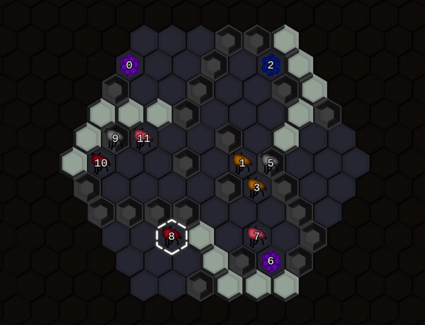

# Bot Royale
A battle royale for bots.



<br>

## Requirements
- [Python 3.9+](https://www.python.org/)
- [Kivy](https://pypi.org/project/Kivy/) for the GUI
- [numpy](https://pypi.org/project/numpy/) because of course
- [pdoc3](https://pypi.org/project/pdoc3/) to create the docs (optional)
- [black](https://github.com/psf/black) for code formatting (optional)
- [flake8](https://flake8.pycqa.org/) for code quality analysis (optional)

It is recommended to use a [virtual environment](https://docs.python.org/3/tutorial/venv.html). Once activated, install the requirements:

`pip install botroyale`

<br>

## Run
The main script:
```bash
botroyale
```

Will choose which module to import and run based on the first command line argument. The default is `gui`. To see other options:
```bash
botroyale --list
```

For example:
```bash
botroyale cli
```

<br>

## Guides and Documentation
To create and view the docs locally (which include guides), run:
```bash
botroyale docs
```
